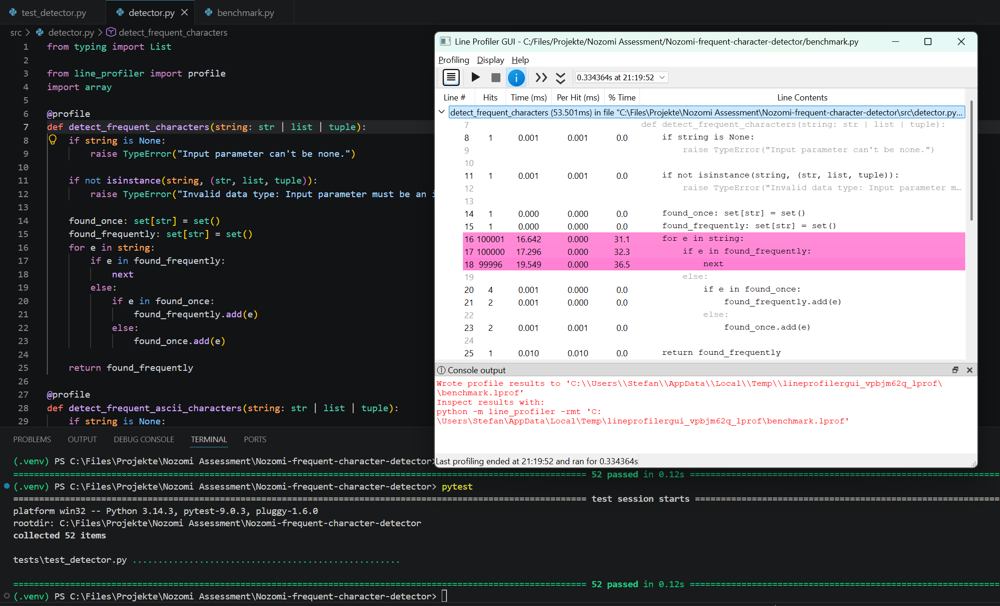
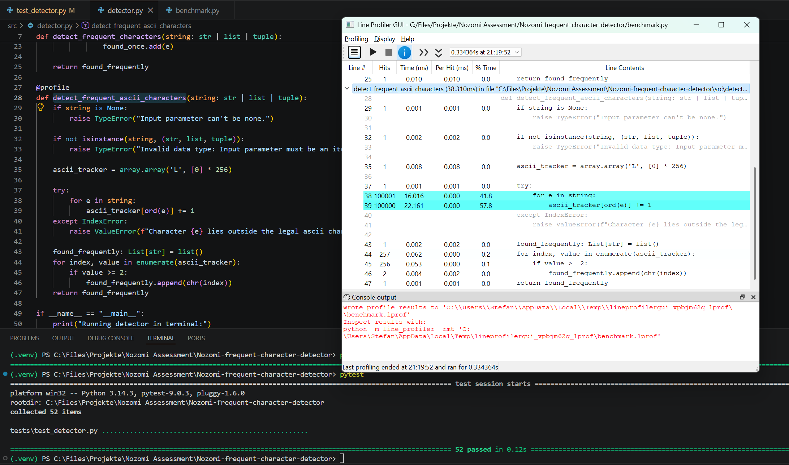

# Nozomi Frequent Character Detector
An algorithm designed for detecting character duplicates within a data stream — optimized for high performance, strict memory determinism, and safety-critical environments.

## Context & Problem Statement
> Write an algorithm that given a string of characters, for example {'c','a','i','o','p','a'}, will print out the list of characters appearing at least 2 times. 

### Technical Considerations
In cybersecurity and network monitoring environments, algorithms must process massive throughput with minimal overhead. Usually, runtime optimization comes at the cost of increased memory usage. This project aims to break that trade-off by introducing a highly storage-efficient, deterministic approach that prioritizes raw CPU performance without sacrificing the memory footprint.

### Measurability & Profiling
To back architectural decisions with hard data, the project utilizes `line-profiler`. This allows for microscopic measurement of hit counts and exact time spent on every single line of code, ensuring that compiler and interpreter behaviors are fully transparent.

### Test-Driven Development (TDD)
Adhering to the principle that *Failure is not an option*, a strict TDD approach was followed. The test suite guarantees that requirements are perfectly met, covering broad scenarios from regular inputs to complex edge cases (e.g., massive repetition, empty structures) and intentional boundary violations. 

The complete test matrix comprising **52 automated validation and safety tests** can be found in the `/tests` folder.

---

## Architectural Approaches
Following the engineering mantra *"Make it work, make it right, make it fast"*, an initial naive dictionary-based solution was used purely as a baseline to pass the initial tests before evolving the architecture into two production-grade patterns:

### 1. The Dual-Set Approach (The Unicode Allrounder)
The `detect_frequent_characters` function utilizes two independent Python `set` structures (`found_once` and `found_frequently`). 
* **Time Complexity:** $O(n)$ — Since the input stream is unsorted, we must iterate through all elements exactly once.
* **Pros:** Highly idiomatic Python, utilizing C-optimized hash tables under the hood. It natively supports the entire **Unicode family** (including Asian characters and Emojis) without exploding the memory space for unused characters.

### 2. The Primitive Array Approach (The Deterministic ASCII High-Speed Solution)
For dedicated, low-latency network protocols limited to the ASCII character set (codes 0–255), `detect_frequent_ascii_characters` leverages Python's native `array.array('L', [0] * 256)`. 
* **Time Complexity:** $O(n)$ for ingestion, but a strict $O(1)$ constant time for evaluating which characters appeared at least twice.
* **Memory Complexity:** **Strictly deterministic.** The continuous chunk of primitive integers allocates exactly **2,048 bytes** on initialization. There are no dynamic heap allocations, no pointer overhead, and zero memory fragmentation. This makes it ideal for resource-constrained IoT or embedded gateway devices.
* **The EAFP Safety Net:** Instead of running costly bounds-checking (`if char_code > 255`) inside the hot loop for every single character, the algorithm applies the **EAFP** (*Easier to ask for forgiveness than permission*) principle. It lets the underlying C-runtime raise an `IndexError` on invalid Unicode inputs, catching it safely outside the loop. Profiling proved that removing the conditional branch inside the loop yields massive performance gains.

---

## Benchmark & Performance Results
The benchmark setup processes a heavy load of **100,000 characters**. The profile results demonstrate the impact of mechanical sympathy:

### Profiling: Dual-Set Strategy
The runtime is dominated by the constant hashing and membership checking of the two sets inside the loop.
* **Average Execution Time:** **~53 ms**
* **Complexity:** $O(n)$ 



### Profiling: Primitive Array Strategy
By reducing the hot loop to a single operational step (direct index incrementation), conditional branching is eliminated.
* **Average Execution Time:** **~40 ms (approx. 25% performance boost)**
* **Complexity:** Ingestion $O(n)$ / Evaluation $O(1)$ constant time.



---

## Future Outlook & Architectural Limits

### The Python 3.14 No-GIL Paradox
While Python 3.14 introduces official support for free-threaded builds to run threads across multiple CPU cores without the Global Interpreter Lock (GIL), **multithreading is highly counterproductive for this specific task**:
1. **Lock Contention:** Multi-threaded ingestion into a shared counter structure requires strict synchronization (`threading.Lock`), which forces sequential thread execution and destroys performance.
2. **Management Overhead:** Spawning, managing, and joining OS threads introduces a latency penalty (5–20 ms) that completely eats up the 40 ms total runtime of our single-threaded array approach.

### The True Production Frontier: Rust & SIMD
To scale this utility to higher line rates, the next logical architectural evolution would be outsourcing the core loop to **Rust** via PyO3. 
In Rust, we could utilize true zero-cost parallelism. It would allow processing chunks of 32 or 64 bytes in a single hardware clock cycle completely parallelized across cores, reducing the runtime from milliseconds to microseconds.

---

## Setup & Validation

Ensure you have Python 3.14+ installed. Follow these steps to set up the environment, run the 52-unit test suite, and execute the line profiler:

### 1. Clone the Repository
```bash
git clone [https://github.com/your-username/Nozomi-frequent-character-detector.git](https://github.com/your-username/Nozomi-frequent-character-detector.git)
cd Nozomi-frequent-character-detector

### 2. Set Up the Virtual Environment
Create a clean environment without automated pip packages to avoid Windows path/subprocess locking:
```bash
python -m venv .venv --without-pip
.venv\Scripts\Activate.ps1
python -m ensurepip --default-pip

### 3. Install Dependencies
``` Bash
pip install pytest line-profiler[PyQt5]

### 4. Execute the Test Suite
Run the automated test matrix to verify requirements, edge cases, and type guard clauses:
```Bash
pytest

### 5. Run the Performance Profiler
``` Bash
lineprofilergui

The configuration window will open. Select `benchmark.py` in the input field called "Python script". Hit save. Next, hit the play button in the top left corner.